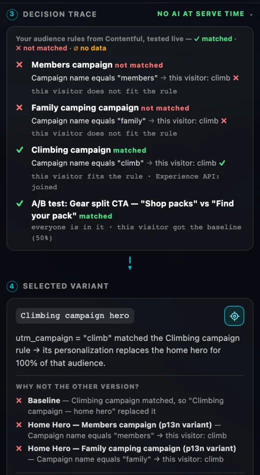
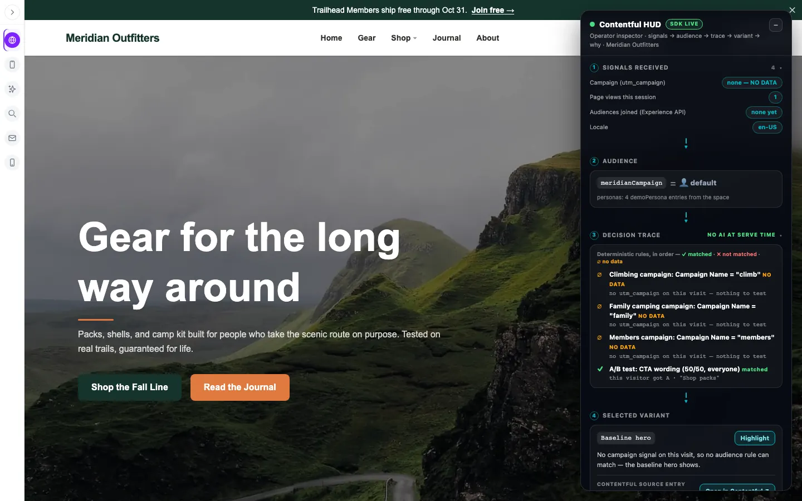
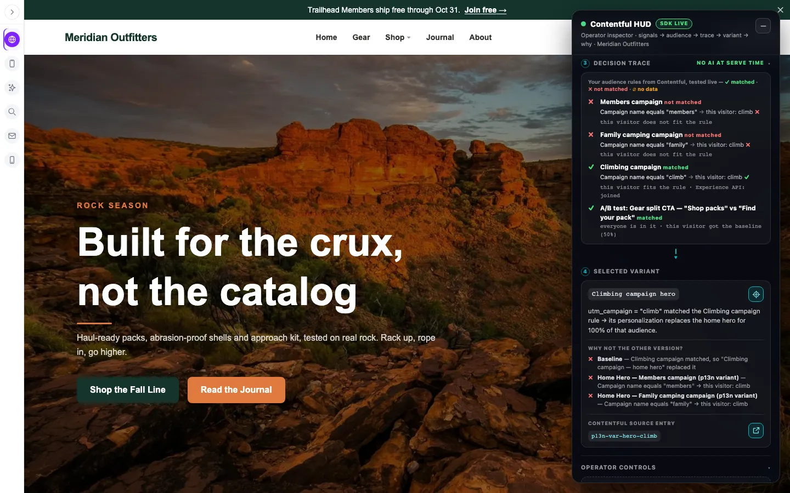
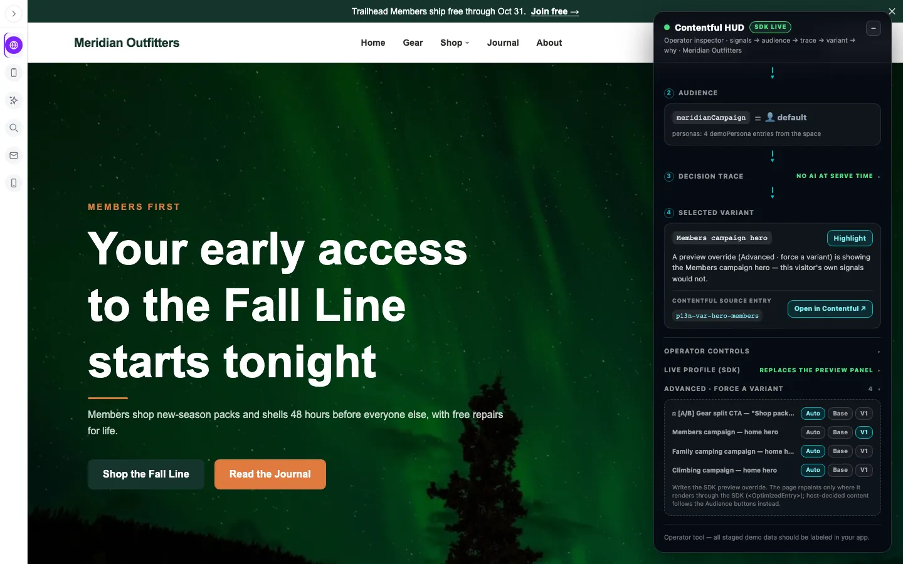

# Contentful P13n HUD

**See the math.** An operator panel for Contentful Personalization demos that shows *why* the
page is showing what it's showing — in the order it happened:

**① signals → ② audience → ③ decision trace → ④ selected variant (+ why)**


*Meridian Outfitters (a fictional brand) with a `?utm_campaign=climb` link: the page swapped its hero, and the HUD shows why.*

The decision trace is the part audiences remember: every rule, in order, marked
**✓ matched · ✗ not matched · ∅ NO DATA** — because "we have no data on this visitor yet" is a
different fact from "this visitor failed the rule", and saying so honestly is the trust moment.



It also does the job of Contentful's standard preview panel (force an audience, force a variant,
see the live profile, reset) by driving the **same official override engine** the panel uses —
so you run one panel on screen, built for storytelling instead of debugging.

This repo is the master copy. It ships as TypeScript source for **Vite + React** apps.

**Who it's for:** anyone demoing or building with Contentful Personalization — solutions engineers,
partners, developers, Contentful employees. No private tooling needed; everything below works from a
fresh Vite + React app and a Contentful space you can edit.

## Before you start (one-time, in Contentful)

1. **Install the Contentful Personalization app** in your space (Apps → Marketplace → Contentful
   Personalization) and, on its **Data buckets** tab, pick a data bucket and **Save**. This is a click in
   the app's own screen — it can't be scripted. Until it's done, audiences never evaluate.
2. **Check the `nt_audience` / `nt_experience` fields use the app's editors** (the rule builder, not a raw
   JSON box). If you created these content types by script, copy their editor settings from a space
   where the app set them up.
3. **Have at least one audience with a rule in the working format** (see *Your first segment* below).


---

## 5-minute quick start

**1. Install** (plus the SDK pieces you probably already have):

```sh
npm install github:milescontentful/contentful-p13n-hud-tool
npm install @contentful/optimization-react-web @contentful/optimization-core contentful
```

**2. Point it at your space** — add to `.env.local` (Vite):

```
VITE_CONTENTFUL_SPACE_ID=<your space id>
VITE_CONTENTFUL_PREVIEW_TOKEN=<Content Preview API token>
VITE_CONTENTFUL_ENVIRONMENT_ID=master          # optional, default master
```

Or in code: `configureP13nHud({ spaceId, environment, previewToken })` once at boot.
With nothing set, the HUD still runs on the personas you pass as props and says so on screen.

**3. Load the audience/experience list once** (in `main.tsx`, next to your `<OptimizationRoot>`):

```tsx
import { loadP13nDefinitions } from 'contentful-p13n-hud-tool'
void loadP13nDefinitions() // reads nt_audience / nt_experience (drafts included) for the forcing controls
```

**4. Drop the HUD on the page** (the ~10 lines that matter):

```tsx
import { OperatorHud } from 'contentful-p13n-hud-tool'

<OperatorHud
  surface="My Site"
  audience={personaKey}                          // which persona is active now
  audienceOptions={[{ key: 'returning', label: 'Returning', emoji: '⭐', color: '#F59E0B' }]}
  traitKey="segment"                             // profile trait the persona sets
  selectedVariant={variantName}
  decisionReason="Returning-customer rule matched."
  signals={[{ q: 'Page views this session', a: '5' }]}
  cfEntryId={shownEntryId}                       // the entry on screen → provenance + "why not the other version?"
  // no `trace` prop: the HUD builds the decision trace from your real audience rules
  onSwitchAudience={setPersonaKey}
  onReset={() => setPersonaKey('new-visitor')}
/>
```

Mark the personalized element with `data-p13n-target` so the **Highlight** button can pulse it.

**What you see:** a "Contentful HUD" pill bottom-right. Click it → the four numbered steps, the
operator controls, and (when the Optimization SDK is running on the page) the live profile plus a
closed-by-default **Advanced · force a variant** section. Drag it anywhere; it remembers where you
left it and which sections were folded, even across a reload. Esc closes it.

Operator actions are small icon buttons — highlight the personalized element, reset to baseline,
forget this profile, open the entry in Contentful, copy the profile id, minimize. Hover any of them
for a tooltip; each has a screen-reader label and a visible focus ring, and every one is at least
28 px square. The decision trace, signals and variant names stay as words.

## The decision trace builds itself ("see the math")

You don't write the trace. The HUD reads each audience's **real rule** (the `nt_rules` field on the
`nt_audience` entry — `loadP13nDefinitions()` already fetches it), tests it against what this page
knows about the visitor, and writes every condition out in plain English with the visitor's live value:

```
✓ Climbing campaign            matched
    Campaign name equals "climb" → this visitor: climb ✓
✗ Family camping campaign      not matched
    Campaign name equals "family" → this visitor: climb ✗
∅ Highly Engaged               NO DATA
    Event contact_sales_clicked ≥ 1 → this visitor: no events yet ∅
    or
    Page URL contains "pricing" → this visitor: 0 of 1 page view ✗
```

**Which audiences:** the ones targeted by the experiences the HUD lists (after `experienceFilter`),
or every audience if none are. Pass `traceAudiences={['aud-id', …]}` to choose. A/B tests with no
audience get a row too: everyone is in it, and which half this visitor got (read from the SDK).

**What it tests against (the "facts"):**

| Fact | Where it comes from by default | Override with |
|---|---|---|
| Pages viewed + their UTM values | the HUD records one per page load (URL + `utm_*`) for the browser session | `facts.pages`, or call `recordPageFact()` on SPA route changes |
| Events | whatever you record with `recordEventFact('name')` next to `sdk.track()` | `facts.events` |
| Traits | the SDK profile's traits | `facts.traits` |
| Audiences the server confirmed | the SDK profile's audiences — shown as "Experience API: joined" beside the math | `facts.confirmedAudiences` |

**Supported rule types**

| Rule (as the Personalization app writes it) | Reads as | Evaluated from |
|---|---|---|
| `page` + `context_campaign_name` (and `_source`/`_medium`/`_term`/`_content`) | Campaign name equals "climb" | the UTM values on pages this session |
| `page` + `context_page_url` / `context_page_referrer` | Page URL contains "pricing" | page URLs this session |
| `page` with a count (≥, >, ≤, <, =) | Viewed any page ≥ 3 times | how many pages match |
| `track` (event name, or `*` for any) with a count | Event contact_sales_clicked ≥ 1 | recorded events |
| `identify` (a trait) | Trait plan equals "pro" | profile traits |

Condition operators: equals (`*` = anything), does not equal, contains, does not contain, starts
with, ends with. Case doesn't matter.

**What it will not guess.** Anything else shows **∅ can't evaluate here (rule type location)** —
location, device, audience-of-audience, event property conditions, unknown operators or keys. A rule
saved with `count` as a number (the format the platform silently ignores) says so too. Missing data is
never counted as a failure: no campaign on this visit is **∅ NO DATA**, not **✗**.

Groups combine the way the platform does: conditions inside a group all have to hold (AND); any one
group is enough (OR). With three outcomes: one ✗ sinks a group, one ✓ group wins the audience,
otherwise it's ∅.

**Why not the other version?** Pass `cfEntryId` (the entry on screen) and the selected-variant card
lists every other version that could have filled the same spot — the baseline plus each experience's
variant for it — with one line on why it lost: the rule condition that failed or had no data, the
traffic split, or an operator override.

**Your own trace still wins.** Pass `trace={[…]}` and the HUD shows yours instead. The evaluator is
also exported (`evaluateAudiences`, `audiencesFromEntries`, `evaluateRule`) if you want the math
elsewhere.

**Honest limit.** This is a local mirror of the platform's logic, for *explaining* a decision. The
Experience API still makes the real decision. The HUD only knows what this browser saw this session,
so a visitor who qualified on an earlier visit can read ∅ here while the server says "joined" —
both are shown, side by side.

**Selftest** (no dependencies, Node 23.6+):

```sh
node test/evaluate.selftest.ts
```

It runs real audience rules (copied from two Contentful spaces into `test/fixtures/`) through matched /
not matched / no-data / can't-evaluate cases, then plants six bugs in a copy of the evaluator (for
example "treat missing data as not matched") and fails unless every one of them is caught.

### Your first segment (link-driven — the easiest thing to demo)

Campaign links are the quickest win: a presenter clicks `?utm_campaign=climb` and the page changes, no
waiting for "3 visits". The audience rule (the `nt_rules` field on an `nt_audience` entry, or build it in
the app's rule builder):

```json
{"any":[{"all":[{"type":"page","count":"1","key":"","operator":"greaterThanInclusive","value":"",
  "conditions":[{"key":{"id":"context_campaign_name","value":"context_campaign_name","key":"context_campaign_name",
  "category":{"name":"utm_parameter","label":"UTM Parameter","type":"string"},"label":"Campaign Name","useOnce":true},
  "operator":"equal","value":"climb"}]}]}]}
```

Then pass the campaign to the SDK yourself — it does not read `utm_*` from the URL on its own:

```ts
const q = new URLSearchParams(location.search)
const campaign = Object.fromEntries(['source','medium','campaign','term','content']
  .map(k => [k === 'campaign' ? 'name' : k, q.get(`utm_${k}`)]).filter(([, v]) => v))
sdk.page({ campaign })   // after the SDK is live — see the preflight checklist
```

Open the link in a fresh (private) window each time — the profile remembers you.

What it looks like — the same page, plain link vs campaign link:

| Plain link — no campaign, so every rule reads **∅ NO DATA** | `?utm_campaign=climb` — the Climbing rule reads **✓ matched** |
|---|---|
|  |  |

A persona whose only job is "show the default" can be passed with `audienceNtId: null` — picking it
forces every other persona's audience off, even on a campaign link.

### Optional rows

Every extra control appears **only when you wire it** — no buttons that do nothing:

| Row | Pass |
|---|---|
| Personalization on/off | `p13nOn` + `onSetP13n` |
| A/B preview (control vs personalized) | `preview` + `onSetPreview` |
| Locale | `locale` + `localeOptions` + `onSetLocale` |
| Content source (fixtures vs Contentful) | `contentSource` + `onSetContentSource` |
| Experience state / entry point | `experienceState` + `experienceStateOptions` + `onSetExperienceState` (same shape for `entryPoint…`) |
| Open-in-Contentful link | `cfEntryId` |
| Limit the Advanced "force a variant" list | `experienceFilter` |

### Personas as content (optional)

If the space has `demoPersona` entries (`personaKey`, `label`, `traitKey`, optional
`audienceNtId`, `emoji`, `color`, `description`), the HUD reads labels/colours from them, so
editors can rename personas without a code change. Content type id is configurable
(`configureP13nHud({ personaContentType })`). Each persona forces the audience whose
`nt_audience_id` is `audienceNtId` — or `aud-<personaKey>` by convention.

---

## Preflight checklist (the landmines)

All of these were found by watching real pages fail silently — nothing errors, the swap
just never happens.

- [ ] **Fire the first page event after the SDK is live.** A `page()` call made during the first
  render hits a placeholder and does nothing. Wait for `useOptimizationContext()` to report the
  live SDK, then call `sdk.page()`.
- [ ] **Two id spaces for audiences.** The SDK's `AudienceDefinition.id` is the `nt_audience_id`
  *field*, but `ExperienceDefinition.audience.id` is the audience entry's *sys id*.
  `loadP13nDefinitions()` builds the bridge between them; if you roll your own loader, do the same.
- [ ] **Write rules in the format the platform actually evaluates.** `count` must be a **string**
  (`"1"`, not `1`) and each rule needs `"key": ""` and `"value": ""` (not `null`). The number/null form
  saves fine and is then silently ignored — the audience never matches anyone, with no error.
- [ ] **Pass UTM values yourself.** The SDK sends an empty `campaign` object even on a
  `?utm_campaign=` URL; read `utm_*` from the URL and pass them to `sdk.page()`.
- [ ] **Load definitions from the Preview API.** Variant entries are often drafts; the Delivery
  API silently drops them, so forcing controls would show nothing.
- [ ] **Don't attach `@contentful/optimization-web-preview-panel` as well.** Two panels driving
  one override engine will fight.
- [ ] **SDK v2 renamed the root prop:** `<OptimizationRoot clientId=…>` is now `spaceId=…`.
  The HUD itself works with SDK 1.2+ and 2.x (type-checked against both).

---

## vs. the standard preview panel

Compared with `@contentful/optimization-web-preview-panel` 2.0.1 (the official panel, Sept 2026):

**What the HUD adds**
- **Decision trace** with a three-state outcome (matched / not matched / NO DATA) — the panel
  shows *what* is on, never *why*.
- **Signals** block — what the personalization layer received, in plain language.
- **Selected variant + reason + provenance** — which Contentful entry produced the pixels, with an
  Open-in-Contentful button.
- **Live profile** — profile id, traits, matched audiences (the panel shows none of this).
- **Personas as content**, one-click persona switching (forces the audience *and* sets the trait
  via `identify()` so it survives a reload), highlight-the-change, full "forget me" reset.
- Presenter UX: draggable, collapsible, remembers layout, dark theme for screen shares.

**Where the panel is still ahead**
- Fuzzy **search** across audience/experience names.
- Every audience listed with a three-way **Off / Default / On** switch (the HUD forces *on* only,
  and only for your personas).
- **"You naturally qualify"** markers on audiences and variants.
- Variant **names and traffic %** shown inline (the HUD puts them in tooltips).
- Forced variants **survive a reload** (the panel saves them; the HUD's are cleared on reload).
- CSP nonce option.

Both drive the same engine (`PreviewOverrideManager`) and both tell the SDK "a preview panel is
open", which makes forced variants repaint immediately.

---

## How it talks to the SDK

All SDK access lives in `src/ntAdapter.ts`, using only official surface:
`window.contentfulOptimization`, `getPreviewPanelBridge` (`@contentful/optimization-core/bridge-support`)
and `PreviewOverrideManager` (`…/preview-support`). No SDK on the page → the audience block reads
"SDK not detected — local decisioning" and all SDK-only UI stays hidden. The HUD never fakes a
capability it doesn't have.

Forced variants repaint anything rendered through the SDK's `<OptimizedEntry>`. Content your app
decides itself (its own rules) follows the persona buttons instead. When several experiences replace
the same entry (three campaign heroes on one home hero), the last variant you click wins — the HUD
clears the other experiences' overrides for that entry first. Use `experienceFilter` to hide
experiences you don't want offered (the Preview API also returns unpublished, retired ones).



## Files

| File | What it does |
|---|---|
| `src/OperatorHud.tsx` | the panel |
| `src/evaluate.ts` | the rule evaluator behind the decision trace (pure — no React, no SDK) |
| `src/facts.ts` | records pages / UTM / events this session for the evaluator |
| `src/whyNot.ts` | "why not the other version?" reasons |
| `src/icons.tsx` | the inline-SVG icon buttons (no icon library) |
| `test/evaluate.selftest.ts` | evaluator selftest + planted-bug check |
| `src/ntAdapter.ts` | every SDK call (persona activation, forcing, profile, reset) |
| `src/optimization.ts` | loads nt_audience / nt_experience with the SDK's own mappers |
| `src/personas.ts` | optional `demoPersona` content loader |
| `src/config.ts` | connection settings (env vars or `configureP13nHud`) |
| `src/index.ts` | public exports |

---

## Troubleshooting

| You see | Likely cause | Fix |
|---|---|---|
| The A/B test splits but no audience ever matches | Rule written with `count` as a number or `null` key/value | Rewrite in the string format above (or rebuild it in the app's rule builder) |
| Campaign link shows the default page | UTM not passed to `sdk.page()`, or you've visited before | Pass `utm_*` (see *Your first segment*); test in a private window |
| "Returning visitor" never kicks in | First page event fired before the SDK was live | Call `sdk.page()` only after `useOptimizationContext()` reports the live SDK |
| Forcing a variant changes nothing on screen | Component not rendered through `<OptimizedEntry>`, or another preview panel is also attached | Render personalized entries through the SDK; use one panel |
| Forcing controls list nothing | Variants are drafts and definitions came from the Delivery API | `loadP13nDefinitions()` uses the Preview API — set a preview token |
| "Configuration needed" banner in the Personalization app | App settings incomplete (often analytics content types) | Harmless for on-site swapping once a data bucket is saved; finish the app's setup checklist for analytics |
| Audience shows as a raw JSON box in the editor | Content type created by script without the app's editor settings | Copy editor settings from a space the app configured |

## Feedback and contributions

Issues and pull requests welcome. Personalization's SDK is young and moving fast — if something here
stops matching what you see, open an issue with the SDK version and what the Experience API returned.

## Credits

Created by **[Miles Stauffer](https://github.com/milescontentful)**, built together with
**[Claude](https://www.anthropic.com/claude)** (Anthropic) as an AI pair programmer.

## License

[MIT](LICENSE) © 2026 Miles Stauffer. Not an official Contentful product — an independent tool that
uses Contentful's public Personalization SDK.

